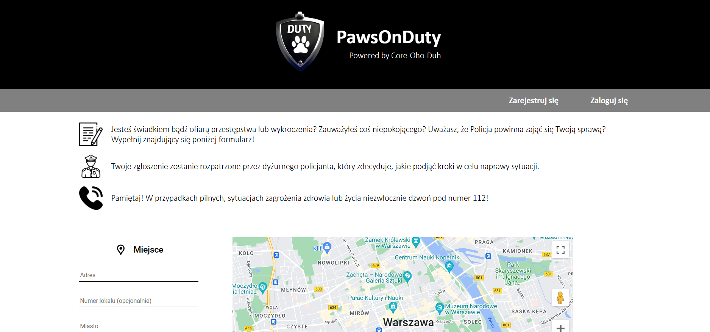
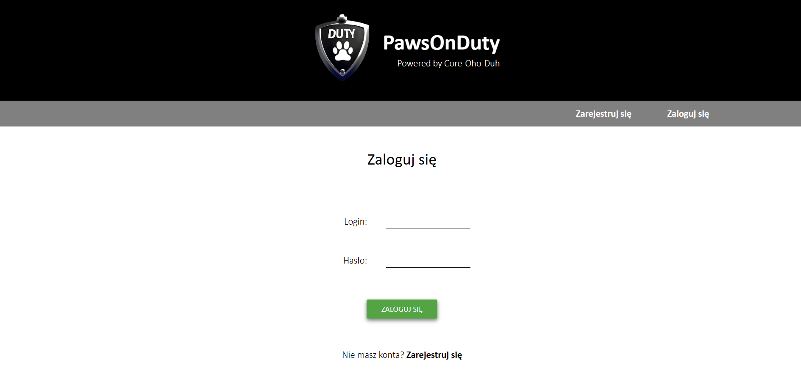
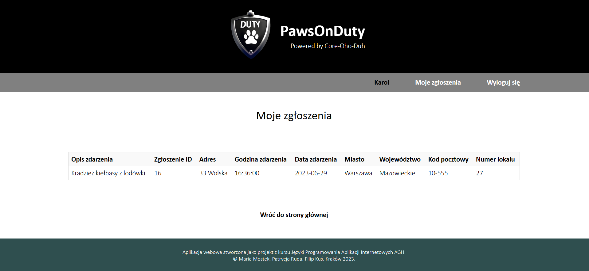
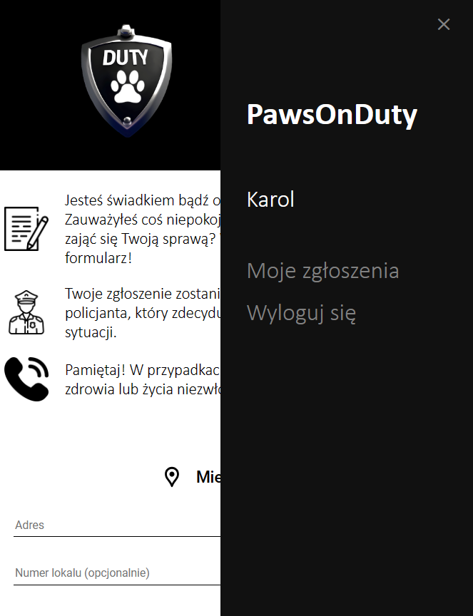

# PawsOnDuty

Web app for reporting incidents to the police. 

Project created for Web application programming languages AGH University of Cracow course. 

## Quick Overview

You can input data about the incident you saw or you found out in the form on the home site. Fill the form with info about location, date and hour, incident description, 
count of offender and their description. You can make and log into your own account. You can also browse history of your reports.

The policeman will receive your report and decide what to do. He can search exact info by date by logging into his special account:  
**login:** paw2  
**password:** pawpaw2

## Screenshots

## Credits

### Contributions:  
**Maria Mostek** - front-end & back-end development, logo design  
**Patrycja Ruda** - back-end develompent  
**Filip Kuś** - front-end development 

### Used API:  
Maps Javascript API by Google - https://developers.google.com/maps/documentation/javascript/overview?hl=pl

### Used icons - thanks do the authors:
Icons 8 - https://www.iconarchive.com/show/ios7-icons-by-icons8/time-and-date-calendar-icon.html  
          https://icons8.com/icons/set/hamburger-button--white 
          
Freepik - https://www.flaticon.com/free-icon/info_1445402?term=info&page=1&position=20&origin=search&related_id=1445402  
          https://www.flaticon.com/free-icon/contact-form_3447545?term=form&page=1&position=5&origin=search&related_id=3447545  
          https://www.flaticon.com/free-icon/policeman_2099783?term=policeman&page=1&position=2&origin=tag&related_id=2099783  
          https://www.flaticon.com/free-icon/user_456212?term=user&page=1&position=1&origin=tag&related_id=456212
          
Gregor Cresnar - https://www.freepik.com/icon/telephone_126341#position=8&page=1&term=phone&fromView=keyword

  Cracow, 2023.
